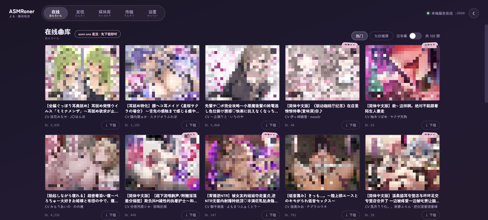
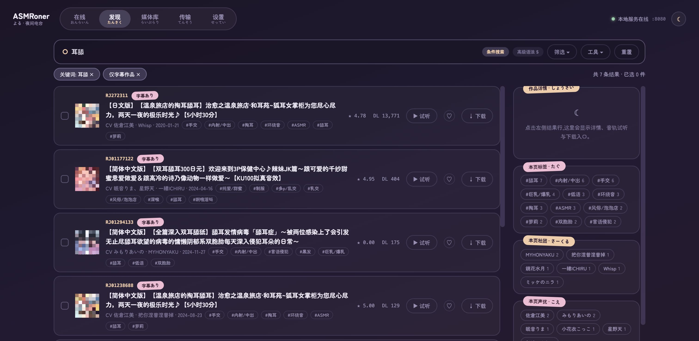
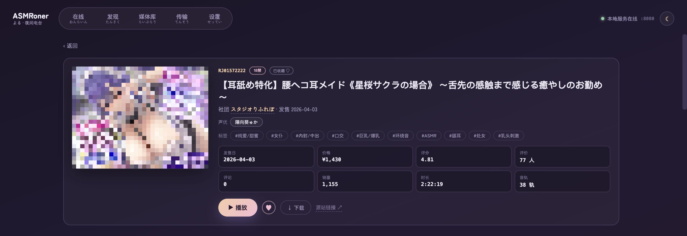
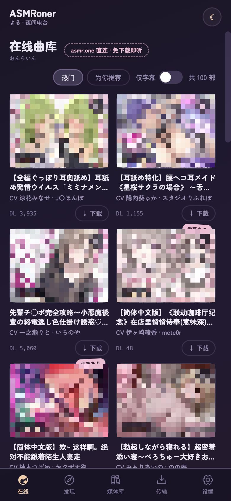

# ASMRoner · よる夜间电台

> 夜深了,把想听的声音,收进自己的电台。

ASMRoner 是一台只属于你的 ASMR 电台:在本地安静地运行,替你检索 asmr.one、收藏喜欢的作品、即刻串流或留档下载,配上逐句跟随的字幕——今晚,接着昨晚继续听。

<p>
  
  
  
  
</p>



## 一夜电台 · つかいかた

### 🔍 发现 · たんさく

关键词、RJ 号,或者把标签、社团、声优随手组合起来;懂行的话,直接贴一段 `$tag:x$ $circle:y$` 高级语法。结果随滚动不断涌现,右边栏把这一批作品的标签、社团、声优摊开来——点一下,就变成新的筛选条件。看中的结果,还能导出成 CSV / JSON 慢慢挑。



### 🗂 详情 · しょうさい

每部作品都有一页完整的档案:完整封面、分级、社团、声优、标签,评分、销量、时长一应俱全,标签和声优点一下就能顺藤摸瓜。往下是整棵文件树——本地已下载的和在线的并排摆着,点哪一轨,就播哪一轨。末尾还有相似作品。



### ♡ 收藏 · これから

作品可收藏进媒体库,随时可以回来串流。下载?那是另一回事——留给没网的日子,不必绑定。本地已下载的作品会自动标上「已下载 ✓」。

### ▶️ 播放 · さいせい

播放条一直守在页面底部,翻页、换栏都不打断。字幕会一句一句跟上声音:播放条上方看当前这一句,展开便是整段字幕卡。听到一半关了也没关系——进度记在本机,本地文件和在线串流一视同仁,下次打开媒体库,「继续收听」就在最上面等你。听得越多,「为你推荐」越懂你(收听行为会反馈给推荐系统,游客身份同样生效)。

### ⬇️ 下载 · てんそう

勾好一批,复核一下范围和目录,放进队列就去忙别的。进度实时推进,失败可以重试,完成可以通知你;元数据同步和失败补下,也都在「传输」一页里。

### 📱 口袋版 · けいたい

底部标签栏、双列网格、全屏播放器。

<p align="center"></p>

## 界面 · がいかん

暗紫夜色是默认,白天有日间模式,另有 4 组配色可换;手帐风贴纸不喜欢可以关掉。Zen Maru Gothic 的圆润字型,从桌面到手机都是同一套语言。

## 开始收听

要求:Go 1.25+、Node.js 22+、npm。

```bash
# 1. 启动后端(首次运行自动生成 .asmroner-data/config.toml)
go run .

# 2. 另开一个终端,启动前端
npm install --prefix apps/yoru
npm run dev:yoru          # http://127.0.0.1:5173
```

**生产模式(单端口)**:`npm run build:yoru && go run .`,直接打开 <http://127.0.0.1:8080>。
Go 按 `ASMRO_WEB_DIR` → `apps/yoru/dist` → `apps/web/dist` → `./web` 的顺序找前端,默认就是「夜 · YORU」;想切回旧前端,把 `ASMRO_WEB_DIR` 指向 `apps/web/dist` 即可。

**桌面 App(macOS)**:`./scripts/build-desktop.sh` 产出 `release/Asmroner.app` 和 dmg——双击即用,后端与前端全部内嵌,带托盘和毛玻璃窗口(macOS 26 为液态玻璃)。详见 [docs/desktop-dev.md](docs/desktop-dev.md)。

上手只需五步:设置里确认下载目录(账号留空即游客)→ 发现里检索,♡ 收藏或复核下载 → 在线里直接听 → 媒体库继续昨晚的进度 → 传输里看队列。

## 本地保存

```text
.asmroner-data/
├── config.toml       # 账号、镜像/代理、下载目录、并发与限流
└── asmroner.db       # SQLite:任务、收藏、播放进度
```

默认只监听 `127.0.0.1:8080`(`--addr` 或 `ASMRO_HTTP_ADDR` 可改;要共享到局域网,请自行做好访问控制)。CORS 白名单可用 `ASMRO_CORS_ORIGINS` 覆盖。镜像只代理检索与元数据,音频由源站直连下载。

## 技术栈

```text
apps/yoru/         新前端「夜 · YORU」(默认;React 19 + Vite + Tailwind v4 + TanStack)
apps/web/          旧前端(保留,不再迭代)
internal/server/   HTTP API、SSE、静态资源与 SPA 托管
internal/services/ 搜索/发现/推荐/媒体库/收藏/任务/同步/播放进度
internal/engine/   asmr.one 上游代理、下载引擎、推荐反馈
internal/store/    SQLite 任务存储
docs/              架构与开发文档
```

后端对前端只暴露 `/api/*` 与 `/media/*`,统一 `{code, message, data}` 包络;实时进度走 `GET /api/events`(SSE);本地媒体经 `/media/...` 伺服,远端音频经 `/api/discover/works/.../stream` 代理,支持 Range。

```bash
go test ./...            # 后端测试
npm run test:yoru        # 前端测试(vitest)
npm run build:yoru       # 前端生产构建
```

前端包内约定见 [apps/yoru/AGENTS.md](apps/yoru/AGENTS.md);更多设计与开发文档见 [docs/](docs/)。

## 说明

本项目仅提供工具能力,检索、元数据与音频内容均来自 asmr.one / DLsite,请遵守源站条款并支持正版。源站内容包含成人向作品,请在符合当地法规的前提下使用;README 截图中封面已做打码处理。
