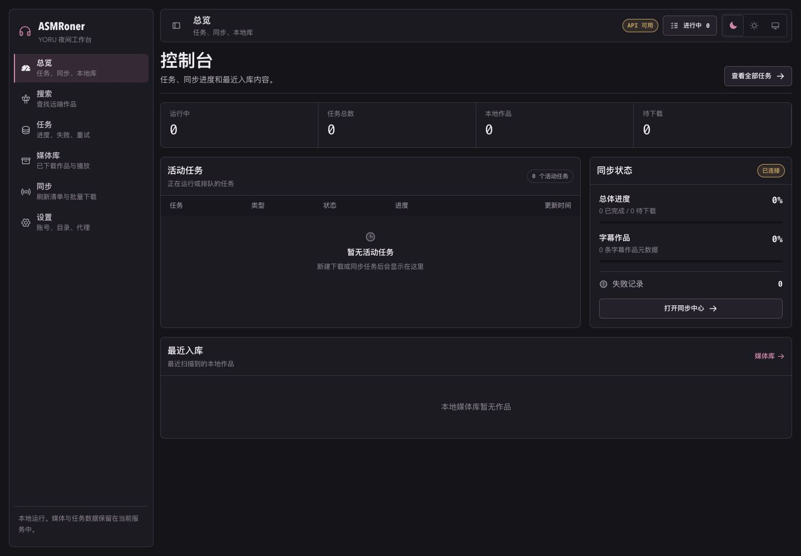

# ASMRoner

把 asmr.one 上想听的作品，稳定地下载、整理并留在自己的设备上。

ASMRoner 是一个本地运行的 ASMR 下载与媒体管理工具。你可以在浏览器里搜索作品、创建下载任务、查看实时进度、重试失败任务，并在下载完成后直接浏览和播放本地音频。

```text
找到作品 -> 加入下载 -> 查看进度 -> 自动整理 -> 本地播放
```

<p>
  
  
  
  
</p>



## 能做什么

- 按标题、RJ 号和标签搜索远端作品，查看作品详情。
- 下载单个作品、批量 RJ、选中的搜索结果或 Hot100 内容。
- 在任务中心查看排队、运行、完成和失败状态。
- 实时接收任务进度与日志，不需要守着终端等待。
- 对失败任务执行重试，并保留之前的任务记录。
- 同步作品元数据，将下载结果整理进本地媒体库。
- 浏览本地文件、播放音频并匹配已有字幕。
- 在界面中管理账号、代理、下载目录、并发和限流配置。

整个工作台运行在本机。任务记录保存在 SQLite 中，配置与媒体文件保存在本地目录中；默认情况下，服务不会暴露到局域网。

## 快速开始

需要准备：

- Go 1.25 或更高版本
- Node.js 22
- npm

### 1. 启动服务

```bash
go run .
```

第一次启动时，ASMRoner 会自动创建 `.asmroner-data/config.toml`。

### 2. 启动网页工作台

打开另一个终端：

```bash
npm install --prefix apps/web
npm run dev:web
```

然后访问：

```text
http://127.0.0.1:5173
```

前端默认连接 `http://127.0.0.1:8080/api`。后端运行在其他地址时，可以这样指定：

```bash
VITE_API_BASE_URL=http://127.0.0.1:18080/api npm run dev:web
```

## 第一次使用

1. 打开“设置”，填写账号信息并确认下载目录。
2. 根据网络环境配置代理、并发数和请求限速。
3. 前往“搜索”，输入作品标题或 RJ 号。
4. 打开作品详情并创建下载任务。
5. 在“任务”中观察进度，必要时取消或重试。
6. 下载和同步完成后，从“媒体库”浏览并播放作品。

总览页会集中显示活动任务、同步状态和最近进入媒体库的作品。顶栏的任务入口可以在任何页面快速查看正在运行的任务。

## 批量下载与同步

除了从搜索结果创建任务，任务中心也支持直接输入多个 RJ 号，以及创建 Hot100 下载任务。

同步页面用于刷新作品清单和元数据，也可以继续下载同步过程中发现的缺失内容。失败记录会保留在报告中，方便之后重新执行，而不是从头开始。

## 本地媒体与播放

媒体库展示已经保存到本地的作品。进入作品后，可以查看目录与文件、播放音频，并在存在匹配字幕时同步显示字幕。

播放器在页面之间保持播放状态，所以可以一边听作品，一边继续搜索或管理下载任务。

## 配置与数据

默认运行目录：

```text
.asmroner-data/
├── config.toml       # 账号、代理、目录和运行参数
└── asmroner.db       # 任务与任务日志
```

实际媒体文件保存在配置的下载或同步目录中。建议定期备份配置文件、任务数据库和媒体目录。

后端默认监听本机回环地址：

```text
127.0.0.1:8080
```

确实需要从其他设备访问时，可以显式指定监听地址：

```bash
go run . --addr :8080
```

这会让服务可以被局域网访问。请同时配置防火墙和访问控制，不要直接暴露到公网。

## 生产构建

```bash
npm run build:web
go run .
```

完成前端构建后，Go 服务会自动提供 `apps/web/dist`。发布包也可以从可执行文件旁的 `web/` 目录加载前端，或通过 `ASMRO_WEB_DIR` 指定其他目录。

## 开发与测试

```bash
# 后端测试
go test ./...

# 前端测试
npm run test:web

# 前端生产构建
npm run build:web
```

主要目录：

```text
apps/web/          React 前端
internal/server/   HTTP 接口与静态资源服务
internal/services/ 搜索、下载、同步、媒体库和任务服务
internal/store/    SQLite 任务存储
internal/engine/   asmr.one 数据与下载引擎
docs/              架构和开发文档
```

进一步阅读：

- [当前项目地图](docs/current-project-map.md)
- [服务端开发说明](docs/server-dev.md)
- [API 草案](docs/api-spec-draft.md)
- [YORU 前端重构说明](<apps/web/docs/ASMRoner 前端重构文档 · YORU_FM「深夜电台」改版.md>)

## 分支说明

这份 README 对应 `codex/yoru-workbench-refactor`。它作为偏向下载器和任务管理的 YORU 工作台版本独立保留，不与默认分支 `v2` 合并。

## 使用边界

请只下载和保存你有权访问的内容，并遵守来源站点规则及相关版权要求。


## 未来版本目标
- 打包软件
- 继续修改前端，大概率会出两种思路的前端版本，分别是下载器和媒体库
- 当前的前端版本是下载器，媒体库版本会在后续开发中出现
- 可以的话，媒体库版本会尽量和asmrone的官方前端功能保持一致
