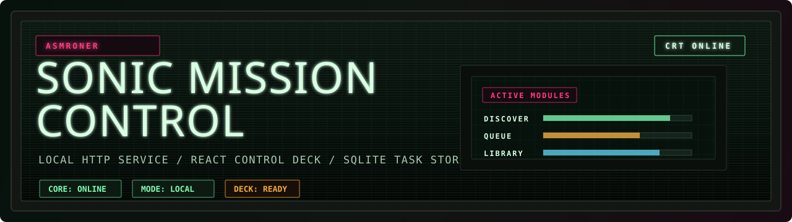
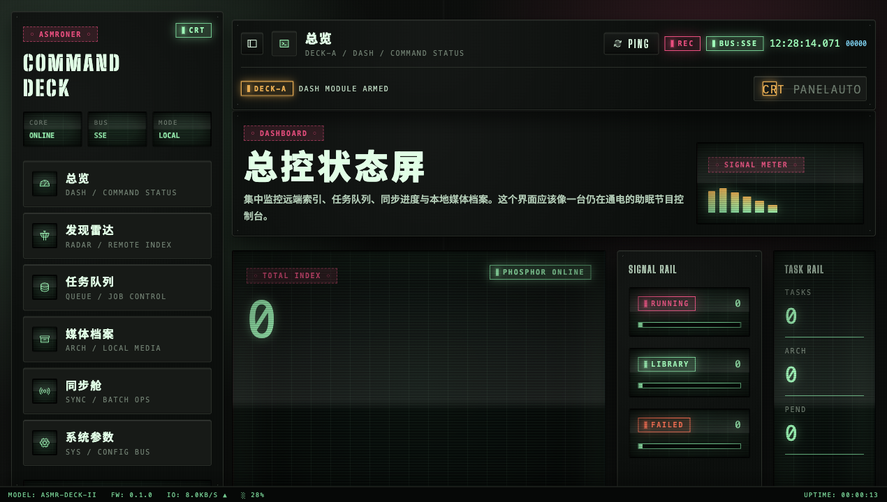

# ASMRoner

<p align="center">
  
</p>

<p align="center">
  <a href="#快速开始">快速开始</a> ·
  <a href="#运行界面">运行界面</a> ·
  <a href="#控制台模块">控制台模块</a> ·
  <a href="#配置与数据">配置与数据</a> ·
  <a href="#开发">开发</a>
</p>

<p align="center">
  
  
  
  
  
</p>

ASMRoner 是一个面向 asmr.one 的本地 Web 控制台，用于完成作品发现、下载编排、元数据同步、本地媒体浏览和音频播放。

项目由 Go HTTP 服务和 React/Vite 前端组成，以 **Sonic Mission Control** 为视觉方向，将下载器、任务队列、同步状态和媒体库组织成一套本机常驻的操作面板。

核心目标是让作品管理流程保持连续：从远端索引检索，到任务执行、状态追踪、失败恢复，再到本地归档和播放，均在同一个界面中完成。

## 运行界面



## 核心工作流

| 工作流 | 能力 |
| --- | --- |
| 作品发现 | 搜索、筛选、查看详情，导出 CSV / JSON |
| 下载编排 | 发起单个作品、批量 RJ、选中结果和 hot100 下载任务 |
| 任务观测 | 使用 SQLite 持久化任务、进度、结果和日志，并通过 SSE 推送实时状态 |
| 元数据同步 | 执行同步、同步下载、失败重试和报告导出 |
| 本地媒体库 | 浏览本地作品、文件、音频、字幕和媒体访问链接 |
| 运行配置 | 管理账号、代理、API、并发、重试、目录、限流和请求头 |

## 快速开始

### 1. 启动后端

```bash
go run . --addr :8080
```

首次启动时，如果 `.asmroner-data/config.toml` 不存在，服务会自动生成默认配置。

### 2. 启动前端

```bash
npm install --prefix apps/web
npm run dev:web
```

访问控制台：

```text
http://localhost:5173
```

默认 API 地址：

```text
http://localhost:8080/api
```

连接其他后端：

```bash
VITE_API_BASE_URL=http://localhost:8080/api npm run dev:web
```

## 控制台模块

| 模块 | 呼号 | 能力 |
| --- | --- | --- |
| 总览 | `DASH / COMMAND STATUS` | 展示运行概览、任务数量、同步进度和本地媒体状态 |
| 发现雷达 | `RADAR / REMOTE INDEX` | 搜索、筛选、作品详情、结果导出、选中下载、RJ 批量下载、hot100 |
| 任务队列 | `QUEUE / JOB CONTROL` | 任务列表、状态过滤、进度、日志、payload / result 检查 |
| 媒体档案 | `ARCH / LOCAL MEDIA` | 本地作品浏览、文件列表、音频播放、字幕匹配、媒体访问 |
| 同步舱 | `SYNC / BATCH OPS` | 元数据同步、同步下载、失败重试、同步报告、导出 |
| 系统参数 | `SYS / CONFIG BUS` | 账号、代理、目录、限流、重试、请求头等持久化配置 |

## 配置与数据

运行时数据默认放在：

```text
.asmroner-data/
```

主配置文件：

```text
.asmroner-data/config.toml
```

`Settings` 页面支持持久化保存账号密码、代理、API 地址、同步目录、优先媒体格式、最大并发、最大重试、QPS 限制、抖动参数和请求头。

后端监听地址可通过环境变量覆盖：

```bash
ASMRO_HTTP_ADDR=:8080
```

## 项目结构

```text
asmr-downloader/
├── apps/web/              # React + Vite 控制台
├── internal/
│   ├── server/            # HTTP 路由与响应编排
│   ├── services/          # 搜索、下载、同步、配置、媒体库、任务服务
│   ├── store/             # SQLite 任务与任务日志存储
│   ├── engine/            # asmr.one 搜索、元数据、音轨与下载引擎
│   ├── model/             # 配置、任务、元数据、同步与音轨模型
│   ├── events/            # SSE 事件中心
│   └── database/          # SQLite 初始化
├── docs/                  # 架构说明与开发参考
├── main.go                # 统一 HTTP 服务入口
└── package.json           # 根目录前端脚本
```

## 开发

```bash
# 后端测试
go test ./...

# 前端测试
npm run test:web

# 前端生产构建
npm run build:web
```

补充文档：

- [当前项目地图](docs/current-project-map.md)
- [服务端开发说明](docs/server-dev.md)
- [API 草案](docs/api-spec-draft.md)
- [前端视觉系统](apps/web/docs/style-system.md)

## 状态与边界

当前主线为 HTTP 服务 + React 控制台架构。旧 Cobra CLI 命令与旧内嵌 `webui` 已经从主运行路径移除。

本项目仅应在有权访问和保存的内容范围内使用，并应遵守来源站点规则与相关版权要求。
